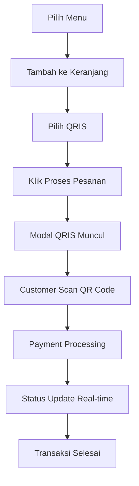

# 🏪 Warung TM - Sistem Kasir dengan Integrasi QRIS

<p align="center">
  
  
  
  
</p>

Sistem Point of Sale (POS) modern untuk warung dengan fitur pembayaran digital QRIS menggunakan Midtrans Payment Gateway. Dibangun dengan Laravel 11 dan Tailwind CSS.

## 🚀 Fitur Utama

### 👑 Untuk Owner:
- ✅ Dashboard analytics dan laporan penjualan real-time
- ✅ Manajemen menu lengkap (CRUD) dengan kategorisasi
- ✅ Manajemen pengguna dan sistem role
- ✅ Laporan penjualan dengan filter tanggal yang fleksibel
- ✅ Riwayat transaksi lengkap dengan detail

### 💰 Untuk Kasir:
- ✅ Interface transaksi yang user-friendly dan responsif
- ✅ Pembayaran tunai dan QRIS terintegrasi
- ✅ Real-time payment processing dengan Midtrans
- ✅ Riwayat transaksi personal
- ✅ Sistem keranjang yang dinamis

### 📱 Payment Integration:
- ✅ **Midtrans QRIS** - Pembayaran digital dengan QR Code
- ✅ **Real-time callback** - Status pembayaran terupdate otomatis
- ✅ **Sandbox testing** - Testing aman tanpa transaksi real
- ✅ **Security features** - Signature verification dan CSRF protection

## 📋 Daftar Isi

- [Requirements](#-requirements)
- [Instalasi Cepat](#-instalasi-cepat)
- [Konfigurasi Detail](#️-konfigurasi-detail)
- [Database Setup](#️-database-setup)
- [Menjalankan Aplikasi](#-menjalankan-aplikasi)
- [User Default](#-user-default)
- [Penggunaan](#-penggunaan)
- [Testing QRIS](#-testing-qris)
- [Production Setup](#-production-setup)
- [Troubleshooting](#-troubleshooting)

## 📦 Requirements

### Minimum System Requirements:
- **PHP**: >= 8.2 dengan extensions: BCMath, Ctype, Fileinfo, JSON, Mbstring, OpenSSL, PDO, Tokenizer, XML
- **Composer**: 2.0 atau terbaru
- **Node.js**: >= 18.x dengan npm (untuk build assets)
- **Database**: MySQL 8.0+ atau MariaDB 10.4+
- **Memory**: Minimum 512MB RAM
- **Storage**: Minimum 1GB free space

### Recommended:
- **Web Server**: Apache 2.4+ atau Nginx 1.18+
- **PHP Memory Limit**: 1GB
- **SSL Certificate**: Untuk production (callback Midtrans)

## ⚡ Instalasi Cepat

### 1. Clone & Install
```bash
# Clone repository
git clone https://github.com/ipamungkas88/Kasir-warungTM.git
cd Kasir-warungTM

# Install dependencies
composer install
npm install && npm run build

# Setup environment
cp .env.example .env
php artisan key:generate
```

### 2. Database Setup
```bash
# Buat database MySQL
mysql -u root -p -e "CREATE DATABASE warungtm;"

# Edit .env untuk database connection
# Kemudian jalankan migration
php artisan migrate --seed
```

### 3. Run Application
```bash
php artisan serve
# Akses: http://127.0.0.1:8000
```

## ⚙️ Konfigurasi Detail

### 1. Environment Configuration
Edit file `.env` sesuai dengan environment Anda:

```env
# App Configuration
APP_NAME="Warung TM"
APP_ENV=local
APP_DEBUG=true
APP_URL=http://localhost:8000

# Database Configuration
DB_CONNECTION=mysql
DB_HOST=127.0.0.1
DB_PORT=3306
DB_DATABASE=warungtm
DB_USERNAME=root
DB_PASSWORD=your_password

# Midtrans Configuration (Sandbox)
MIDTRANS_SERVER_KEY=SB-Mid-server-GwUP_WGbJPMxIc4IA5KCHyab
MIDTRANS_CLIENT_KEY=SB-Mid-client-nKsqvar5cn60u2Lv
MIDTRANS_IS_PRODUCTION=false
MIDTRANS_IS_SANITIZED=true
MIDTRANS_IS_3DS=true
```

### 2. Midtrans Setup
- **Sandbox**: Gunakan credentials di atas untuk testing
- **Production**: Daftar di [Midtrans Dashboard](https://dashboard.midtrans.com/) dan ganti credentials

## 🗄️ Database Setup

### Auto Setup (Recommended):
```bash
php artisan migrate --seed
```

### Manual Setup:
```bash
# 1. Buat database
CREATE DATABASE warungtm CHARACTER SET utf8mb4 COLLATE utf8mb4_unicode_ci;

# 2. Run migrations
php artisan migrate

# 3. Seed data (opsional)
php artisan db:seed
```

### Database Structure:
- `users` - User management (owner/kasir)
- `menus` - Menu items dengan kategori
- `transactions` - Transaksi penjualan
- `transaction_items` - Detail item transaksi
- `sessions` - Session management

## 🚀 Menjalankan Aplikasi

### Development:
```bash
# Start server
php artisan serve

# Watch file changes (optional, separate terminal)
npm run dev

# Access application
# http://127.0.0.1:8000
```

### Production:
```bash
# Build production assets
npm run build

# Cache optimization
php artisan optimize
php artisan config:cache
php artisan route:cache
php artisan view:cache
```

## 👤 User Default

Setelah seeding, login dengan akun berikut:

| Role | Username | Password | Access |
|------|----------|----------|--------|
| **Owner** | `owner` | `owner123` | Full system access |
| **Kasir** | `kasir` | `kasir123` | Transaction only |

> ⚠️ **Security**: Ganti password default setelah login pertama!

## 📱 Penggunaan

### Dashboard Owner:
1. **Login** dengan akun owner
2. **Dashboard** - Lihat analytics penjualan hari ini
3. **Manajemen Menu** - Tambah/edit menu dan kategori
4. **Laporan Penjualan** - Export dan analisis data
5. **Manajemen User** - Kelola akun kasir

### Transaksi Kasir:
1. **Login** sebagai kasir
2. **Pilih Menu** dari katalog yang tersedia
3. **Tambah ke Keranjang** dengan quantity
4. **Pilih Payment Method**:
   - **Tunai**: Input jumlah bayar manual
   - **QRIS**: Pembayaran digital otomatis
5. **Proses Transaksi**

### Flow Pembayaran QRIS:


## 🧪 Testing QRIS

### Sandbox Environment:
1. **Gunakan credentials** yang sudah ada di `.env`
2. **Test dengan Midtrans Simulator**: [simulator.sandbox.midtrans.com](https://simulator.sandbox.midtrans.com/)
3. **Test Numbers**: Gunakan dummy payment methods
4. **Monitor Logs**: `tail -f storage/logs/laravel.log`

### Test Scenarios:
```bash
# Test successful payment
- Select QRIS payment
- Use simulation successful payment

# Test failed payment  
- Use simulation failed payment
- Check error handling

# Test pending payment
- Use simulation pending payment
- Check status updates
```

## 🏭 Production Setup

### 1. Environment Production:
```env
APP_ENV=production
APP_DEBUG=false
APP_URL=https://yourdomain.com

# Production Midtrans
MIDTRANS_IS_PRODUCTION=true
MIDTRANS_SERVER_KEY=your_production_server_key
MIDTRANS_CLIENT_KEY=your_production_client_key
```

### 2. Midtrans Dashboard Configuration:
- **Notification URL**: `https://yourdomain.com/midtrans-callback`
- **Finish Redirect URL**: `https://yourdomain.com/kasir/transaksi`
- **Error Redirect URL**: `https://yourdomain.com/kasir/transaksi`
- **Enable Payment Methods**: QRIS, GoPay, ShopeePay, dll

### 3. Server Configuration:
```nginx
# Nginx configuration sample
server {
    listen 80;
    server_name yourdomain.com;
    root /var/www/html/public;
    
    index index.php;
    
    location / {
        try_files $uri $uri/ /index.php?$query_string;
    }
    
    location ~ \.php$ {
        fastcgi_pass unix:/var/run/php/php8.2-fpm.sock;
        fastcgi_index index.php;
        fastcgi_param SCRIPT_FILENAME $realpath_root$fastcgi_script_name;
        include fastcgi_params;
    }
}
```

## 🔧 Troubleshooting

### Common Issues:

#### 1. Database Connection Failed:
```bash
# Check database service
sudo systemctl status mysql

# Test connection
php artisan tinker
>>> DB::connection()->getPdo();
```

#### 2. Midtrans Token Error:
```bash
# Verify Midtrans config
php artisan tinker
>>> config('midtrans.server_key');
>>> config('midtrans.client_key');
```

#### 3. Permission Issues:
```bash
# Linux/Mac
sudo chmod -R 775 storage bootstrap/cache
sudo chown -R www-data:www-data storage bootstrap/cache

# Windows (Run as Administrator)
icacls storage /grant Users:F /T
icacls bootstrap/cache /grant Users:F /T
```

#### 4. Asset Not Loading:
```bash
# Clear caches
php artisan cache:clear
php artisan config:clear
php artisan route:clear
php artisan view:clear

# Rebuild assets
npm run build
```

#### 5. Payment Callback Issues:
- Pastikan URL callback bisa diakses public
- Check SSL certificate untuk production
- Verify signature key di logs

## 📚 API Endpoints

### Payment API:
- `POST /kasir/create-payment-token` - Generate Snap token
- `POST /midtrans-callback` - Payment notification webhook
- `GET /kasir/check-payment-status/{orderId}` - Manual status check

### Transaction API:
- `POST /kasir/transaksi` - Create cash transaction
- `GET /kasir/riwayat-transaksi` - Transaction history
- `GET /kasir/transaksi/{id}/detail` - Transaction detail

## 🔐 Security Features

- **CSRF Protection** untuk semua form
- **SQL Injection Prevention** dengan Eloquent ORM
- **XSS Protection** dengan Blade templating
- **Password Hashing** dengan bcrypt
- **Role-based Access Control**
- **Midtrans Signature Verification**
- **Environment Variable Protection**

## 📊 Performance Tips

```bash
# Production Optimization
php artisan optimize
php artisan config:cache
php artisan route:cache
php artisan view:cache

# Database Indexing
# Indexes sudah ada di migrations

# Caching
# Implementasi Redis cache (optional)
```

## 🤝 Contributing

1. Fork repository ini
2. Buat feature branch (`git checkout -b feature/amazing-feature`)
3. Commit perubahan (`git commit -m 'Add amazing feature'`)
4. Push ke branch (`git push origin feature/amazing-feature`)  
5. Buat Pull Request

## 📞 Support & Contact

- **GitHub Issues**: [Buat Issue Baru](https://github.com/ipamungkas88/Kasir-warungTM/issues)
- **Email**: support@warungtm.com
- **Documentation**: [Wiki Pages](https://github.com/ipamungkas88/Kasir-warungTM/wiki)

## 📄 License

Project ini menggunakan [MIT License](LICENSE) - lihat file LICENSE untuk detail lengkap.

## 🙏 Acknowledgments

- **Laravel Framework** - Web application framework
- **Midtrans** - Payment gateway solution
- **Tailwind CSS** - Utility-first CSS framework
- **Indonesian Warung Community** - Inspiration & feedback

---

<p align="center">
<strong>Made with ❤️ for Indonesian Small Business</strong><br>
<em>Membantu UMKM Indonesia Go Digital</em>
</p>
